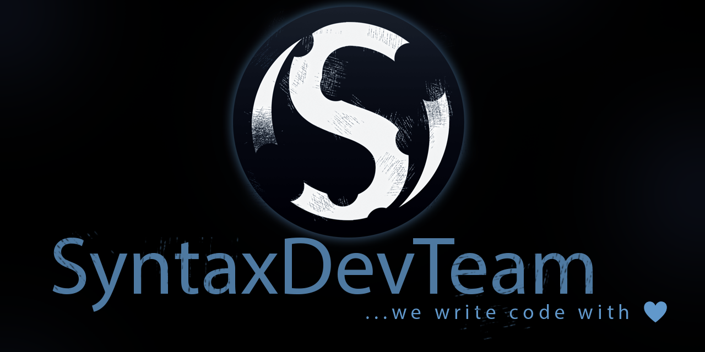

   
 
# Proudly Introducing PunisherX

PunisherX is an advanced moderation plugin for Paper/Folia servers focused on punishments, investigation tools, and admin workflow automation.
It provides complete punishment coverage (`/ban`, `/banip`, `/mute`, `/jail`, `/warn`, `/kick`) with temporary/permanent durations, plus direct recovery commands (`/unban`, `/unmute`, `/unjail`, `/unwarn`, `/clearall`).

The plugin also includes operator tools such as `/check`, `/history`, `/banlist`, `/change-reason`, and `/punish` templates, as well as GUI panels for moderators and report handling.
PunisherX supports message customization with MiniMessage/Legacy/plain formats, config auto-migration between versions, and multiple database backends (SQLite, H2, MySQL, MariaDB, PostgreSQL) for both standalone and network environments.

## ✅ Key Features
* [x] Built for Paper 1.20.6, 1.21 - 1.21.11, 26.1-26.1.2 and compatible forks, including improved Folia support.
* [x] Actively maintained with up-to-date APIs and backward compatibility.
* [x] Language files with full **MiniMessage** and Legacy formatting support, plus new translations.
* [x] Support for Discord webhook integration.
* [x] PlaceholderAPI support for dynamic placeholders.
* [x] Easy database export/import/migrate via simple commands.
* [x] Extensive configuration with automatic versioned migration that preserves admin changes.
* [x] Flexible unjail behavior with five spawn modes and a dedicated `/setunjail` command to avoid conflicts.
* [x] Action-bar countdowns for active punishments and configurable post-punishment actions, including warning escalation.
* [x] Update notification system with optional auto-update support.
* [x] IP geolocation lookup support with async processing and a free MaxMind license key.
* [x] Fallback ban system in case of database access issues.
* [x] One-command full punishment clearance for any player.
* [x] Full jail support via command or configuration.
* [x] Sync-Bridge modules for BungeeCord and Velocity.
* [x] Requires Java 21 or higher.

If you have questions or need help, feel free to join our [Discord](https://discord.gg/Zk6mxv7eMh)

---

## 📦 Download

* Always up-to-date stable version available for download on:
  * Modrinth 
  * Hangar   
* SNAPSHOT and DEV versions available immediately on Github 
* You can also build the development version yourself  or download the last valid build 
---

## ⚙️ Installation

1. Download the latest PunisherX release.
2. Place the JAR file in your server's `plugins` folder.
3. Start your Minecraft server.
4. Configure: The `config.yml` file contains a wide range of customization options.

---

## 💬 Commands & Permissions

PunisherX groups permissions by their purpose:

* `punisherx.cmd.*` – access to commands
* `punisherx.manage.*` – administrative configuration tasks
* `punisherx.see.*` – visibility of broadcasted punishments or updates
* `punisherx.bypass.*` – ability to ignore specific punishments

A full list of commands and permissions is available in the **[Wiki](https://github.com/SyntaxDevTeam/PunisherX/wiki)**.

---

## 📞 Contact

If you need support or have any questions, join our [Discord](https://discord.gg/Zk6mxv7eMh)  
or message us directly via DM.

---

## 📄 License

This plugin is licensed under the **MIT License**.  
You can find the full license text in the [LICENSE](https://github.com/SyntaxDevTeam/PunisherX/blob/main/LICENSE) file.

---

**Thank you for using PunisherX! We hope it meets your expectations. 😊**

---
