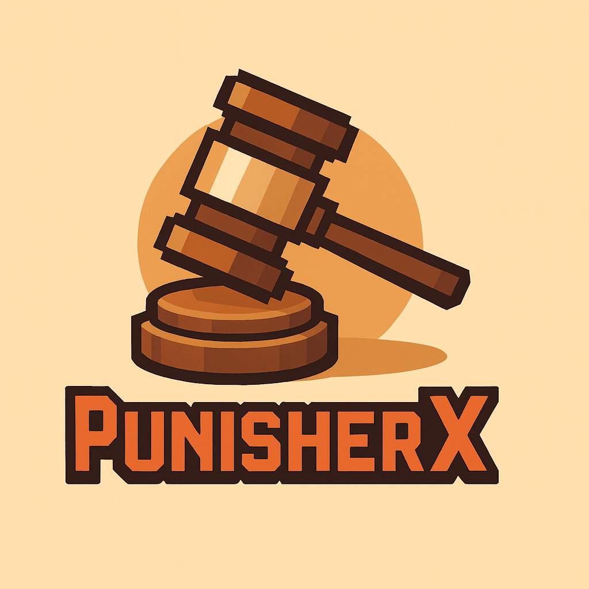
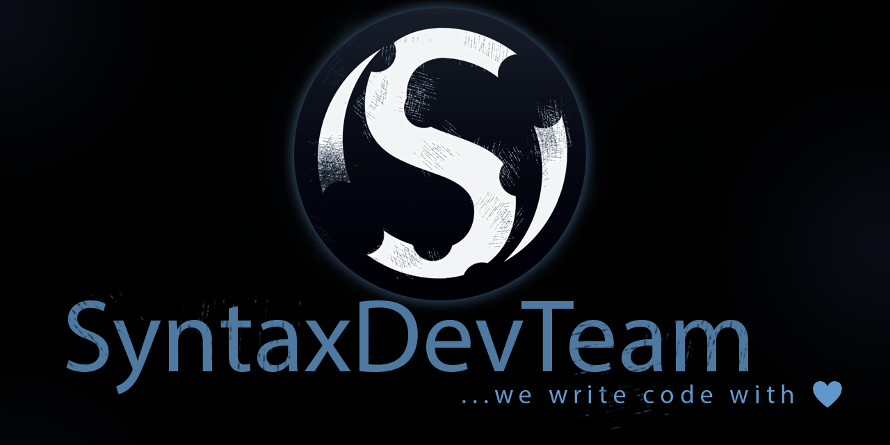

<div align="center">
  
  <h1>PunisherX</h1>
  <p><strong>From player reports to the right punishment — keep moderation in one place.</strong></p>
  <p>
    <a href="#-download"></a>
    <a href="#-download"></a>
    <a href="#-download"></a>
    <a href="#-download"></a>
    <a href="#-download"></a>
  </p>

[](https://github.com/SyntaxDevTeam/PunisherX/actions/workflows/buildexplorer.yml)
[](https://hangar.papermc.io/SyntaxDevTeam/PunisherX)
[](https://modrinth.com/plugin/punisherx)
[](LICENSE)

**[Download](#-download)** · **[Quick start](#-quick-start)** · **[Documentation](#-documentation)** · **[Changelog](CHANGELOG.md)** · **[Discord](https://discord.gg/Zk6mxv7eMh)**

</div>

PunisherX brings punishments, player investigations and report handling together for Minecraft staff. Use commands for direct action, open `/panel` for a guided moderation workflow, or apply a configured punishment template when consistency matters.

It works on standalone servers and networks, with a dedicated **Paper/Folia edition**, a **native Spigot edition**, and optional proxy bridges. This README describes the current `main` branch; check the [changelog](CHANGELOG.md) and download's version notes for the features included in a particular release.

## ✨ Moderation tools

| Tool | What your staff can do |
| --- | --- |
| **Punishments** | Ban players or IPs, mute, warn, kick and jail; use timed or indefinite punishments where applicable, and revoke them when needed. |
| **Moderation panel** | Search players, inspect active punishments and history, and work with online and offline player lists through `/panel`. |
| **Quick punishments** | Apply templates from `punish-templates.yml`, with escalation levels selected from punishment history. Edit GUI duration and reason presets in-game. |
| **Player reports** | Accept `/report` submissions, browse the staff inbox, resolve or reject reports with an explanation, and retain a history of decisions. |
| **Investigation** | Use `/check`, `/history` and `/banlist`; view IP information with permission, GeoIP details when configured, and recorded logout locations. |
| **Native Paper dialogs** | Use report forms, report management, punishment list views and reason editing on Paper 1.21.7+, with inventory/chat interfaces on older Paper and Spigot. |

### Built for your server's rules

* **Flexible jail release:** choose a configured unjail point, the player's previous location, bed, EssentialsX/FoliEssentials spawn, or world spawn.
* **Automated follow-up:** configure punishment actions and warning escalation, with action-bar countdowns for active mute and jail punishments.
* **Custom messages:** MiniMessage, legacy and plain-text formatting, bundled translations including Korean, and defaults for missing translation keys.
* **Integrations:** Discord webhooks, PlaceholderAPI and asynchronous MaxMind GeoIP lookups when a license key is configured.
* **Database choices:** SQLite, H2, MySQL, MariaDB and PostgreSQL, with export, import and migration tools.
* **Network moderation:** server-scoped punishments and proxy bridges; the Velocity bridge also checks active network-wide bans at login.

### Safer configuration updates

Run `/prx validate` to check configuration and language YAML without modifying the files. `/prx reload` validates first and keeps the working instance running if a checked YAML file is invalid.

Custom language files use bundled defaults for missing keys instead of being rewritten. An invalid language file at startup can fall back to the bundled translation, preserving the original and creating a safety copy. Read more in [Language and YAML safety](docs/LANGUAGE-SAFETY.md).

## 📦 Download

Find published versions on **[Hangar](https://hangar.papermc.io/SyntaxDevTeam/PunisherX)**, **[Modrinth](https://modrinth.com/plugin/punisherx)** and **[GitHub Releases](https://github.com/SyntaxDevTeam/PunisherX/releases)**. Development build artifacts are available from successful [build workflow runs](https://github.com/SyntaxDevTeam/PunisherX/actions/workflows/buildexplorer.yml).

Choose the artifact for the platform where it will run:

| Platform | Artifact | Java |
| --- | --- | --- |
| Paper, Folia and compatible forks | `PunisherX-Paper-<version>.jar` | 21+; also meet your server's requirement. |
| Spigot | `PunisherX-Spigot-<version>.jar` | 21+; also meet your server's requirement. |
| Velocity 4 | `PunisherX-Velocity-Bridge-<version>.jar` | 25+ |
| BungeeCord | `PunisherX-BungeeCord-Bridge-<version>.jar` | 21+ |

The server editions currently recognize Minecraft **1.20.6**, **1.21–1.21.11**, **26.1–26.3**. Native dialogs require Paper 1.21.7+. Use the Paper artifact for Folia; install a bridge on the proxy in addition to PunisherX on backend servers.

## 🚀 Quick start

1. Download the Paper/Folia or Spigot artifact matching your server and place it in `plugins/`.
2. Start the server to generate the configuration and language files.
3. Configure `config.yml` and your database connection. For a network, configure punishment scope and the proxy bridge's database connection as described in the administrator guide.
4. Grant staff the permissions they need. Start with `punisherx.cmd.panel` for panel access; individual actions require their own permissions.
5. Run `/prx validate`, then `/prx reload` after configuration changes. Restart the server when replacing the plugin JAR.

Open `/panel` to investigate a player, `/reports` to review reports, or use `/punish <player> <template>` to apply a configured template.

## 💬 Commands and permissions

| Task | Commands | Access |
| --- | --- | --- |
| Apply punishments | `/ban`, `/banip`, `/mute`, `/warn`, `/kick`, `/jail` | Corresponding `punisherx.cmd.*` nodes. |
| Revoke punishments | `/unban`, `/unmute`, `/unwarn`, `/unjail`, `/clearall` | Corresponding command permissions. |
| Use punishment templates | `/punish <player> <template> (level)` | `punisherx.cmd.punish` |
| Open the moderation panel | `/panel` | `punisherx.cmd.panel` or management access. |
| Submit a player report | `/report (player) (reason)` | Players; no dedicated permission. |
| Read reports | `/reports`, `/reports view <id>`, `/reports history` | `punisherx.see.reports` or report management access. |
| Handle reports | `/reports resolve <id> <explanation>`, `/reports reject <id> <explanation>` | `punisherx.manage.reports` or management access. |
| Validate and reload | `/prx validate`, `/prx reload` | `punisherx.cmd.prx` |
| Edit GUI duration/reason presets | Preset editor in the punishment GUI. | `punisherx.manage` or `punisherx.manage.*` |

For exact syntax, all permission nodes, parent permissions and Spigot dispatch differences, use the **[command reference](docs/WIKI/EN/COMMANDS.md)** and **[permission reference](docs/WIKI/EN/PERMISSIONS.md)**.

## 📚 Documentation

| Reference | English | Polski |
| --- | --- | --- |
| Administrator guide | [Setup and workflows](docs/WIKI/EN/ADMIN-GUIDE.md) | [Konfiguracja i obsługa](docs/WIKI/PL/ADMIN-GUIDE.md) |
| Commands | [Command reference](docs/WIKI/EN/COMMANDS.md) | [Komendy](docs/WIKI/PL/COMMANDS.md) |
| Permissions | [Permission reference](docs/WIKI/EN/PERMISSIONS.md) | [Uprawnienia](docs/WIKI/PL/PERMISSIONS.md) |
| Configuration | [Configuration reference](docs/WIKI/EN/CONFIGS.md) | [Konfiguracja](docs/WIKI/PL/CONFIGS.md) |
| Placeholders | [Placeholder reference](docs/WIKI/EN/PLACEHOLDERS.md) | [Placeholdery](docs/WIKI/PL/PLACEHOLDERS.md) |
| API | [API reference](docs/WIKI/EN/API.md) | [API](docs/WIKI/PL/API.md) |

Additional references: [LuckPerms display names](docs/LUCKPERMS-NAMES.md), [language safety](docs/LANGUAGE-SAFETY.md), [report workflow](docs/REPORTS.md), [Paper UUID migration integration](docs/IDENTITY_MIGRATION.md), and the [GitHub Wiki](https://github.com/SyntaxDevTeam/PunisherX/wiki).

## 🛠️ Build from source

Build all server and proxy modules:

```bash
./gradlew clean buildAll
```

Build only one server edition:

```bash
./gradlew :punisherx-paper:build -Ppunisherx.build.modules=paper
./gradlew :punisherx-spigot:build -Ppunisherx.build.modules=spigot
```

Plugin artifacts are written to each module's `build/libs/` directory. Server modules use a Java 21 toolchain; the Velocity bridge uses Java 25.

Release versions are declared in [build.gradle.kts](build.gradle.kts). Dependency and Gradle plugin versions are centralized in [gradle/libs.versions.toml](gradle/libs.versions.toml), which also supplies the Paper and Spigot runtime library manifests.

## 🤝 Support and contributions

Join our **[Discord](https://discord.gg/Zk6mxv7eMh)** for support, or report a reproducible bug through **[GitHub Issues](https://github.com/SyntaxDevTeam/PunisherX/issues)**. Include your plugin version, server platform/version, relevant logs and steps to reproduce.

Contributions, translations and feedback are welcome. PunisherX is released under the **[MIT License](LICENSE)**.

<p align="center">
  
</p>
