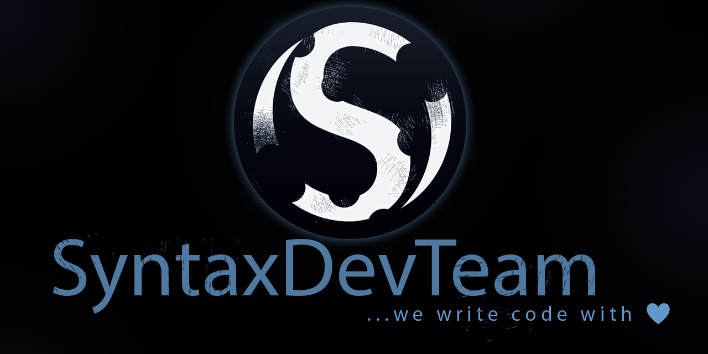

   
 
# Proudly Introducing PunisherX

PunisherX is a comprehensive punishment system offering commands like `kick`, `warn`, `mute`, `jail`, `ban`, and `ban-ip` — with both temporary and permanent options.  
With support commands like `/check`, `/history`, and `/banlist`, administrators can quickly review a player's current punishment status or browse a full list of banned users.

Designed for speed and convenience, PunisherX includes customizable templates for punishment reasons, allowing quick and consistent enforcement.  
It also offers a complete message file for full translation and customization, supporting **MiniMessage**, Legacy, and plain Minecraft formatting.  
A detailed configuration file and support for various database types (MySQL/MariaDB, PostgreSQL for multi-server sync, and SQLite/H2 for high-performance standalone use) make it flexible and production-ready.

## ✅ Key Features
* [x] Built specifically for Paper 1.20.6, 1.21+, and compatible forks.
* [x] Actively maintained with up-to-date APIs and full backward compatibility.
* [x] Language file with full **MiniMessage** and Legacy formatting support.
* [x] Support for Discord webhook integration.
* [x] PlaceholderAPI support for dynamic placeholders.
* [x] Easy database export/import/migrate via simple commands.
* [x] Extensive configuration file for flexible customization.  
  → Check the default settings [here](https://github.com/SyntaxDevTeam/PunisherX/blob/main/src/main/resources/config.yml)
* [x] Update notification system with optional auto-update support.
* [x] IP geolocation lookup support with a free MaxMind license key.
* [x] Fallback ban system in case of database access issues.
* [x] One-command full punishment clearance for any player.
* [x] Full JAIL support via command or configuration.
* [x] Requires Java 21 or higher.

If you have questions or need help, feel free to join our [Discord](https://discord.gg/Zk6mxv7eMh)

---

## 📦 Download

* Always up-to-date stable release available on Hangar  
  

* You can also build the development version yourself from  
  

* Or download the latest pre-built development version from GitHub Actions:  
  [GitHub Actions](https://github.com/SyntaxDevTeam/PunisherX/actions/workflows/gradle.yml)

---

## ⚙️ Installation

1. Download the latest PunisherX release.
2. Place the JAR file in your server's `plugins` folder.
3. Start your Minecraft server.
4. Configure: The `config.yml` file contains a wide range of customization options.

---

## 💬 Commands & Permissions

PunisherX groups permissions by their purpose:

* `punisherx.cmd.*` – access to commands
* `punisherx.manage.*` – administrative configuration tasks
* `punisherx.see.*` – visibility of broadcasted punishments or updates
* `punisherx.bypass.*` – ability to ignore specific punishments

A full list of commands and permissions is available in the **[Wiki](https://github.com/SyntaxDevTeam/PunisherX/wiki)**.

---

## 📞 Contact

If you need support or have any questions, join our [Discord](https://discord.gg/Zk6mxv7eMh)  
or message us directly via DM.

---

## 📄 License

This plugin is licensed under the **MIT License**.  
You can find the full license text in the [LICENSE](https://github.com/SyntaxDevTeam/PunisherX/blob/main/LICENSE) file.

---

**Thank you for using PunisherX! We hope it meets your expectations. 😊**

---