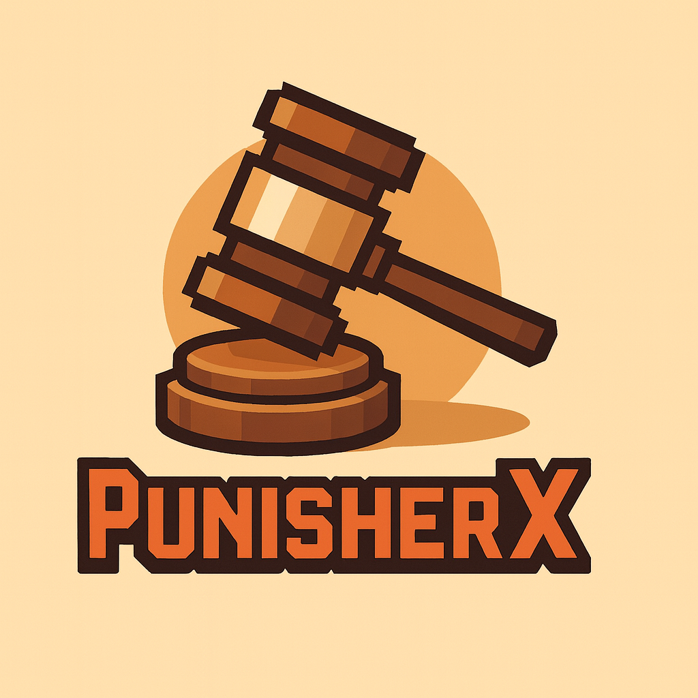
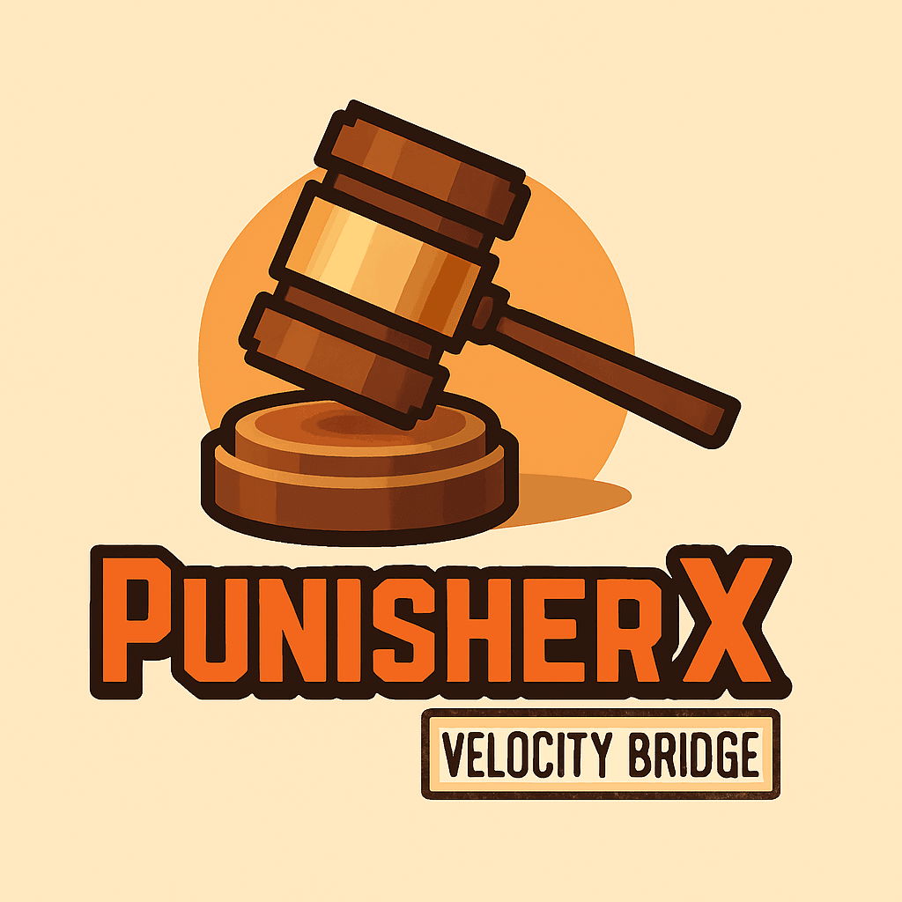

# Poradnik dla Admina (PL)

> Praktyczny przewodnik dla właścicieli serwerów i młodszej kadry moderatorskiej: od instalacji, przez konfigurację, aż po debug i rozwiązywanie problemów.

---

## 1) Dla kogo jest ten poradnik?

Ten materiał jest dla administratora, który chce:
- szybko uruchomić PunisherX,
- bezpiecznie nadać uprawnienia moderatorom,
- sprawnie używać komend i szablonów `/punish`,
- wiedzieć, co sprawdzić gdy „coś nie działa”.

Jeśli jesteś początkujący: czytaj sekcje po kolei.  
Jeśli jesteś zaawansowany: skocz do sekcji **Debug** i **Znane problemy**.

---

## 2) Szybki start (instalacja w 10 minut)

### Wymagania
- Paper/Folia (zalecane aktualne buildy),
- Java 21+,
- dostęp do folderu `plugins/`.

### Kroki
1. Pobierz aktualne wydanie PunisherX.
2. Wgraj plik `.jar` do `plugins/`.
3. Uruchom serwer i poczekaj, aż plugin wygeneruje pliki.
4. Skonfiguruj `plugins/PunisherX/config.yml`.
5. Uruchom serwer ponownie.
6. Wejdź jako admin i sprawdź:
   - `/punisherx version`
   - `/punisherx reload`
---

## 3) Pierwsza konfiguracja

### 3.1 Język i komunikaty
- Otwórz `config.yml` i ustaw `language: pl` lub wybrany inny z dostępnych.
- W folderze lang znajdziesz plik językowy (np. `messages_pl.yml`).
- Edytuj do własnych potrzeb.
- Utrzymuj jednolity styl komunikatów (krótko, bez caps-locka).

### 3.2 Baza danych
Dla małego serwera wystarczy SQLite/H2.  
Dla sieci lub większego ruchu przejdź na MySQL/MariaDB/PostgreSQL.

> Sprawdź nasz dodatek dla proxy [PunisherX-Proxy-Bridge](https://modrinth.com/plugin/punisherx-proxy-bridge), jeśli masz sieć i chcesz synchronizować bany między serwerami.

### 3.3 Uprawnienia (najczęstszy błąd)
Nie dawaj `*` każdemu moderatorowi. Rozdziel role! Przykładowo:
- **JuniorMod**: `warn`, `mute`, `check`, `history`
- **Mod**: + `kick`, `jail`, `unjail`
- **Admin**: pełny dostęp operacyjny
- **Owner/TechAdmin**: migracje, import/export, krytyczne akcje

To obniża ryzyko przypadkowych masowych kar.

---

## 4) Praktyczne użycie komend (workflow moderatora)

### 4.1 Typowy scenariusz
1. Sprawdź historię gracza:
   - `/check <nick> all`
   - `/history <nick>`
2. Wybierz adekwatną karę:
   - ostrzeżenie (`/warn`) dla lekkich naruszeń,
   - czasowy mute (`/mute`) za spam/wulgaryzmy,
   - ban (`/ban`) dla ciężkich i powtarzalnych naruszeń.
3. Użyj jasnego powodu (konkretny punkt regulaminu).
4. Po odwołaniu gracza: weryfikacja + ewentualne `/unmute`/`/unban`.

### 4.2 Komendy, które warto znać na pamięć
- `/warn <gracz> (czas) <powód>`
- `/mute <gracz> (czas) <powód>`
- `/jail <gracz> (czas) <powód>`
- `/ban <gracz> (czas) <powód>`
- `/unwarn`, `/unmute`, `/unjail`, `/unban`
- `/check`, `/history`, `/banlist`
- `/change-reason <id> <nowy_powód>`
- `/clearall <gracz>` (ostrożnie, to operacja masowa)

Format czasu: `Xs`, `Xm`, `Xh`, `Xd` (sekundy/minuty/godziny/dni).

---

## 5) Szablony `/punish` – jak ich używać mądrze

Szablony dają powtarzalność i szybkość działania. Dzięki nim młodszy moderator nie „wymyśla” kary samodzielnie za każdym razem.

### Dobre praktyki dla templatek
- Jeden szablon = jeden konkretny typ naruszenia.
- Nazwy krótkie i jednoznaczne (np. `spam_1`, `cheaty_perm`).
- Powód zawsze zgodny z regulaminem (np. „Reg. 3.2 – spam”).
- Rozdziel poziomy eskalacji (1h → 1d → 7d → perm).

### Przykładowa logika progresji
- Pierwsze wykroczenie: `/warn`
- Drugie wykroczenie: `/mute 1h`
- Trzecie wykroczenie: `/mute 1d`
- Czwarte wykroczenie: `/ban 7d`

Największa wartość templatek: jednolita polityka kar między zmianami moderatorów.

---

# Planowane:
## 6) Panel GUI i praca „klikana”

PunisherX oferuje GUI, które przyspiesza codzienną moderację:
- wybór gracza,
- wybór typu kary,
- wybór czasu i powodu,
- szybkie przejście do historii.

Jeśli kadra jest młoda, GUI + predefiniowane szablony to najlepsze połączenie (mniej błędów, mniej literówek).

---

## 7) Debug krok po kroku (checklista)

Gdy komendy nie działają poprawnie:

1. **Wersja i status pluginu**
   - `/punisherx version`
   - sprawdź logi przy starcie serwera.

2. **Uprawnienia**
   - czy gracz/mod ma właściwe permission nodes,
   - czy nie ma konfliktu z managerem permisji.

3. **Konfiguracja**
   - czy `config.yml` i pliki językowe nie mają błędów składni,
   - po zmianach użyj `/punisherx reload` lub bardziej zalecane restart serwera

4. **Baza danych**
   - czy dane dostępowe są poprawne,
   - czy baza odpowiada i nie blokuje połączeń.

5. **Integracje**
   - PlaceholderAPI, webhooki, bridge proxy – testuj osobno, nie wszystko naraz.
   - Sprawdź, czy inny plugin nie powoduje konfliktów (np. inny system kar).

6. **Cache i diagnostyka**
   - użyj `/prx diag` gdy potrzebujesz szybkiego testu i danych dla supportu.

> Zasada: najpierw potwierdź wersję + permisje + bazę, dopiero później szukaj „egzotycznych bugów”.

---

## 8) Znane problemy i szybkie rozwiązania

### Problem: „Komenda istnieje, ale nie działa”
Najczęściej brak permisji albo konflikt aliasu z innym pluginem.  
**Rozwiązanie:** sprawdź permission nodes i listę aliasów w `config.yml`.

### Problem: „Kara nie zapisuje się globalnie na sieci”
Zwykle problem z bazą lub bridge.
**Rozwiązanie:** test połączenia DB + logi modułu bridge.

### Problem: „Niepoprawne kolory/format komunikatów”
Błędna składnia MiniMessage/Legacy w plikach językowych.
**Rozwiązanie:** cofnięcie ostatnich zmian i edycja sekcja po sekcji.

### Problem: „Moderatorzy karzą nierówno”
Brak standardu pracy.
**Rozwiązanie:** wdroż szablony `/punish`, tabelę eskalacji i krótkie SOP dla kadry.

---

## 9) Krótka procedura pracy dla zespołu moderatorskiego

To jest odpowiednik SOP (Standard Operating Procedure), czyli prosty, stały schemat działania dla moderatora.

1. Zawsze zaczynaj od `/check` i `/history`.  
2. Nigdy nie karz „z pamięci”, tylko na podstawie faktów.  
3. Używaj templatek zamiast wolnego wpisywania powodów.  
4. Każda surowa kara musi mieć uzasadnienie w regulaminie.  
5. Wątpliwość = eskalacja do Admina, nie zgadywanie.

To jest różnica między „chaotyczną moderacją” a profesjonalnym zespołem.

---

## 10) Kontakt z autorem i społecznością
**SyntaxDevTeam** jest otwarty na feedback, pytania i zgłoszenia problemów.  
### Skontaktuj się z nami:
- Discord społeczności: **https://discord.gg/Zk6mxv7eMh**
- Repozytorium: **https://github.com/SyntaxDevTeam/PunisherX**
- Zgłoszenia problemów: Issues na GitHub (najlepiej z logiem i wersją serwera/pluginu)

### Przy zgłoszeniu zawsze podaj:
- wersję PunisherX,
- wersję Paper/Folia,
- wersję Java,
- fragment logu,
- kroki odtworzenia błędu.

---

## 11) Podsumowanie z doświadczenia

Jeśli chcesz profesjonalnej moderacji, nie wystarczy „mieć dobry plugin”.  
Musisz mieć: **dobrą konfigurację + sensowne permisje + politykę kar + procedurę debugowania**.

PunisherX daje narzędzia. Jakość moderacji zależy od standardu, który narzucisz zespołowi. Zainwestuj czas w szkolenie moderatorów i ustalenie jasnych zasad, a efekty będą widoczne od razu! **Powodzenia!**
