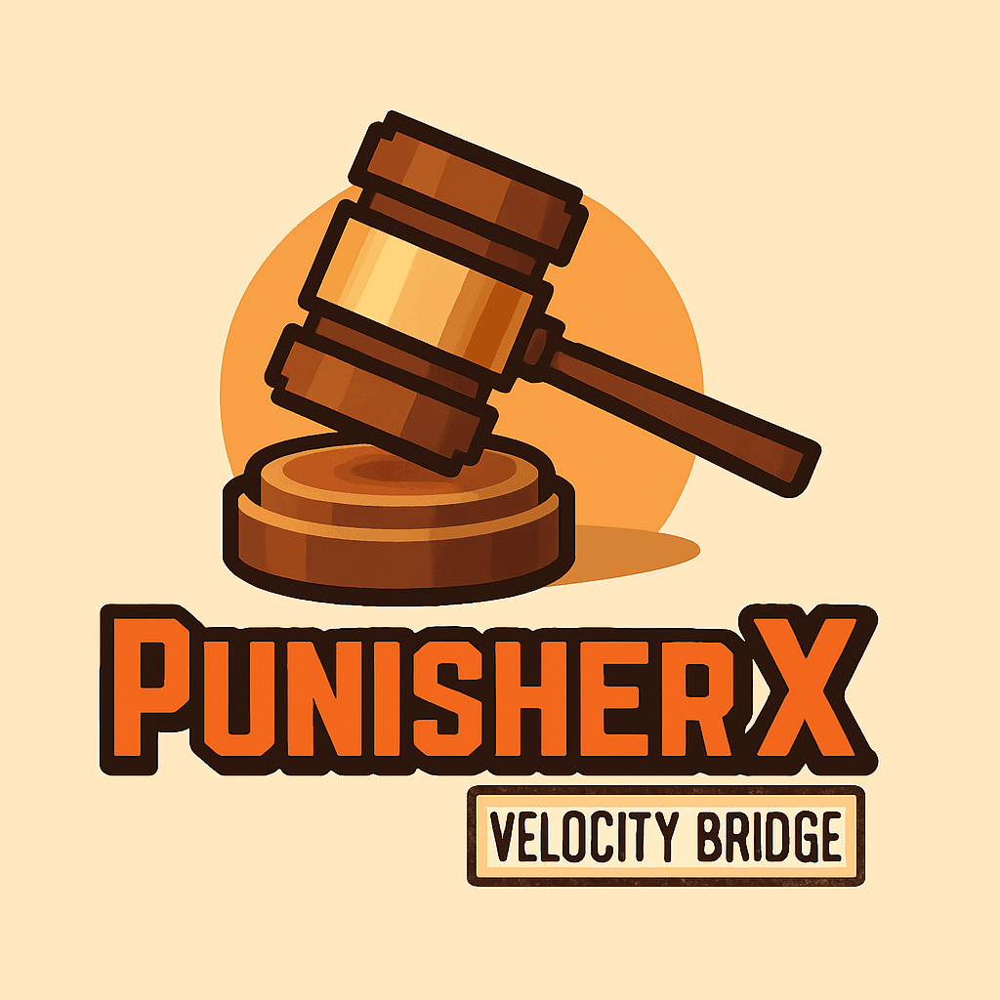

<div align="center">
  
  <h1>PunisherX Velocity Bridge</h1>
  <p><strong>One network. Shared bans. Moderation that follows the player.</strong></p>
  <p>
    <a href="#-requirements"></a>
  </p>

[](https://github.com/SyntaxDevTeam/PunisherX/actions/workflows/buildexplorer.yml)
[](#-requirements)
[](#-requirements)
[](#-configuration)
[](../LICENSE)

**[Download](#-download)** · **[Quick start](#-quick-start)** · **[Configuration](#-configuration)** · **[Documentation](../docs/WIKI/EN/ADMIN-GUIDE.md)** · **[Discord](https://discord.gg/Zk6mxv7eMh)**

</div>

PunisherX Velocity Bridge connects your Velocity proxy to the PunisherX installation on your backend servers. A ban issued from one backend can disconnect its target elsewhere on the network, even when the command runs from the console on an empty server.

Install the bridge on the **proxy**, alongside the full PunisherX plugin on your **Paper/Folia or Spigot backends**. Both use the same MySQL database.

## ✨ Network moderation

| Feature | What it does |
| --- | --- |
| **Cross-server bans** | Disconnects a player by UUID when a `BAN` event reaches the proxy. |
| **IP ban events** | Disconnects connected players whose IP matches a `BANIP` event. |
| **Persistent event queue** | Polls the shared `bridge_events` table, so events can arrive even from an empty backend. |
| **Backend messages** | Also receives `BAN` and `BANIP` through the `punisherx:bridge` plugin messaging channel. |
| **Login and transfer checks** | Checks active network-wide UUID bans at login and before connecting to a backend. |
| **Clear disconnect messages** | Shows the punishment type, reason and remaining duration, including permanent bans. |

The bridge handles **BAN and BANIP events**. Login and backend transfer checks currently query **UUID-based BAN records with `server = network`**; they do not query active IP bans. Other punishments, such as mute, warn and jail, are handled by PunisherX on the backend servers.

## 📦 Download

Download `PunisherX-Velocity-Bridge-<version>.jar` from **[GitHub Releases](https://github.com/SyntaxDevTeam/PunisherX/releases)** when available. Development artifacts are available from successful **[build workflow runs](https://github.com/SyntaxDevTeam/PunisherX/actions/workflows/buildexplorer.yml)**.

Looking for the backend plugin or the BungeeCord artifact? See the **[main PunisherX README](../README.md#-download)**.

## ⚙️ Requirements

| Component | Requirement |
| --- | --- |
| Proxy | **Velocity 4**; the current project targets `4.2.1-SNAPSHOT`. |
| Java | **25 or newer** on the proxy. |
| Backend plugin | PunisherX for Paper/Folia or Spigot. |
| Storage | A shared **MySQL database**, reachable from the proxy and backends. |
| Database access | Read punishment records; read/write bridge events; create `bridge_events` if it is absent. |

## 🚀 Quick start

1. Install PunisherX on your backend servers and configure them to use the shared MySQL database.
2. Place `PunisherX-Velocity-Bridge-<version>.jar` in the proxy's `plugins/` directory.
3. Start the proxy once to generate `bridge.properties` in the bridge's plugin data directory.
4. Set the database connection in that file to the same database used by PunisherX on the backends.
5. Restart the proxy to load the connection settings.
6. Configure network-wide punishment scope on the backends, following the **[administrator guide](../docs/WIKI/EN/ADMIN-GUIDE.md)**.

## 🔧 Configuration

The bridge reads **`bridge.properties`**. Example:

```properties
host=localhost
port=3306
database=punisherx
username=punisherx
password=replace_with_your_database_password
poll-interval-ms=1000
```

| Setting | Meaning |
| --- | --- |
| `host` / `port` | Address of the shared MySQL server. `localhost` refers to the machine running the proxy. |
| `database` | The database containing PunisherX's `punishments` and `bridge_events` tables. |
| `username` / `password` | Credentials with access to those tables. |
| `poll-interval-ms` | Queue polling interval in milliseconds. Default: **1000**; values below **200** are clamped to 200. |

Match the backend's `database.sql.*` connection settings. Credentials can differ if both database users have the required access to the same database. Restart the proxy after editing this file.

## 🔄 How it works

1. PunisherX writes a `BAN` or `BANIP` event to the shared `bridge_events` table.
2. The proxy bridge polls unprocessed events at the configured interval and disconnects matching connected players.
3. Each handled event is marked as processed, so later polls skip it.
4. Independently, login and backend transfer checks read active network-wide UUID bans from `punishments`. Processing a queue event does not remove the corresponding punishment.

For example, a moderator on **Survival** bans a player currently on **Lobby**. The bridge reads the event and disconnects that player from Velocity. If the UUID ban is stored with network scope and remains active, the login check disconnects the player when they try to return.

## 🛠️ Troubleshooting

| Symptom | Check |
| --- | --- |
| Database connection fails | Host, port, credentials, database access and connectivity from the proxy. |
| A ban does not reach the proxy | Both sides must use the same database; verify that the backend creates a `bridge_events` entry. |
| A UUID ban does not block rejoining | The record must have `punishmentType = BAN`, `server = network` and an active expiry, or `endTime = -1` for a permanent ban. |
| An IP-banned player can reconnect | Active IP bans are not checked by the bridge's login query; backend enforcement still needs to be configured. |
| Changes to connection settings have no effect | Restart the proxy after editing `bridge.properties`. |

## 🧱 Build from source

From the repository root:

```bash
./gradlew :punisherx-velocity-bridge:build
```

Use a **Java 25 toolchain**. The resulting plugin JAR is written to `punisherx-velocity-bridge/build/libs/`.

## 📚 Links

**[PunisherX](../README.md)** · **[Admin guide (EN)](../docs/WIKI/EN/ADMIN-GUIDE.md)** · **[Admin guide (PL)](../docs/WIKI/PL/ADMIN-GUIDE.md)** · **[Changelog](../CHANGELOG.md)** · **[Report an issue](https://github.com/SyntaxDevTeam/PunisherX/issues)**

Licensed under the **[MIT License](../LICENSE)**. Created by **SyntaxDevTeam**.
